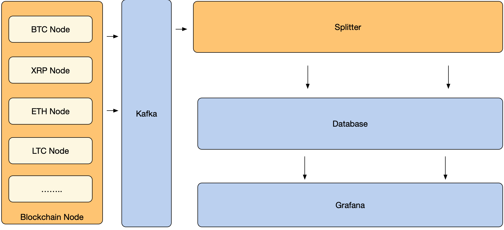

# bds-eth

## Introduction
bds-eth is one of the independent modules in open source project of block chain data service (BDS) - provides full node service.

*bds-eth* Based on the v1.9.9 version of [ethereum/go-ethereum](https://github.com/ethereum/go-ethereum),*bds-eth* redeveloped to support sending new block data directly to message middleware service of kafka to facilitate upstream services to subscribe and consume.

## Architecture 


## Environmental Deployment
### Install ETH
#### Environment Initialization
[build](./docs/build.md)

#### Install steps

1. Compile

 ```
   make geth
 ```

   or, to build the full suite of utilities:
   
 ```
   make all
 ```
 
2. Run full node and support sending messages to Kafka

```
  geth --rpc --datadir <data directory> --rpcapi admin,db,eth,debug,miner,net,shh,txpool,personal,web3 --syncmode full --gcmode=archive --cache 4096 console --port <port> --rpcport <rpcport> --kafka.endpoint <kafka rest proxy, default "http://localhost:8082/topics/eth">
```

### Install confluent and kafka
#### Install kafka
See [kafka](https://kafka.apache.org/quickstart)

##### Modify config/server.properties 

* message.max.bytes=1048576000

#### Install confluent 
see [confluent](https://docs.confluent.io/current/installation/installing_cp/zip-tar.html#prod-kafka-cli-install)

Unzip the confluent package and run Confluent REST Proxy

##### Modify  <path-to-confluent>/etc/kafka-rest/kafka-rest.properties 

* max.request.size = 1048576000
* buffer.memory = 1048576000
* send.buffer.bytes = 1048576000

### Install BDS 
See [BDS](https://github.com/jdcloud-bds/bds)

### Database
Database we now support SQL Server, PostgreSQL, you can choose one as a data storage method.

#### SQL Server
Buy [JCS For SQL Server](https://www.jdcloud.com/cn/products/jcs-for-sql-server)

#### PostgreSQL 
Buy [JCS For PostgreSQL](https://www.jdcloud.com/cn/products/jcs-for-postgresql)

### Install Grafana 
See [Grafana Official](https://grafana.com/)

## New funtion 

1. The new function of sending messages to Kafka is added（every time a new block is synchronized by full node, the data of the block is sent to kafka and the data structure is customized).
2. Sendblock and sendbatchblock are newly added as RPC interfaces to trigger full node to send data for a specific block.

### Source Code Change History
[bds-eth](./CHANGE_HISTORY.md)

## Contributing
[Contributing guide](./CONTRIBUTING.md)

## License
[Apache License 2.0](./LICENSE)

## Project Demonstration
[Blockchain Data Service](https://bds.jdcloud.com/)

